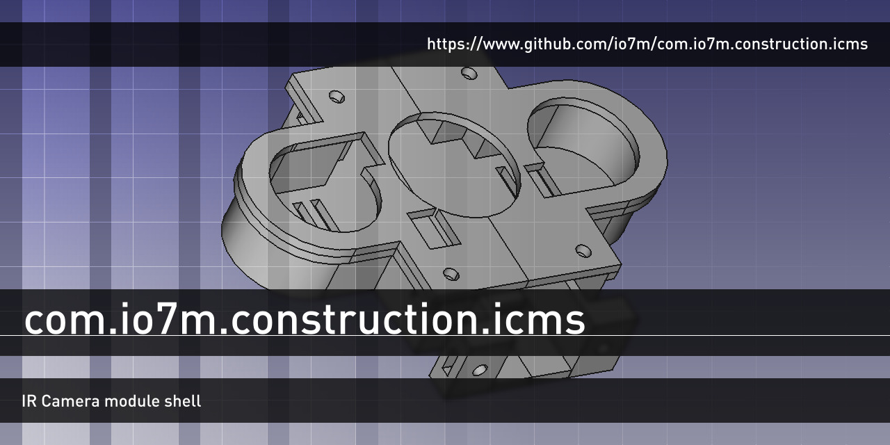
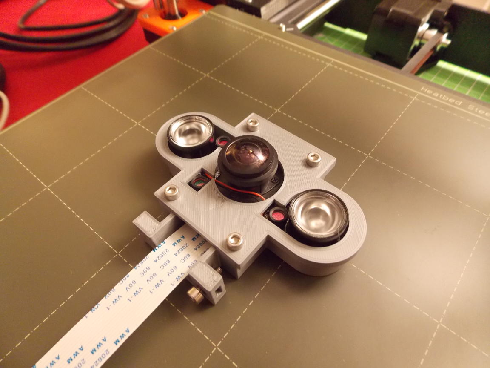

com.io7m.construction.icms
==

A 3D-printable shell for the _MakerHawk OV5647_ webcam module.



Fabrication
===

The model is divided into two parts: The _upper shell_ and the
_lower shell_. The two parts are designed to be independently
printable.

1. Place [upper.stl](upper.stl) and [lower.stl](lower.stl) into the
   [slicer](https://github.com/Slic3r/Slic3r) of your choice.

2. The meshes will print without any support structures on any
   good quality printer. The model should be printed at `<= 0.2mm`
   layer height. The model has only been tested on a [Prusa i3 MK3S](https://www.prusa3d.com/original-prusa-i3-mk3/).

Assembly
===

Bill of materials:

  * 6 x DIN 562 M3 (Square nut)
  * 6 x ISO 4762 Hexagon socket head cap screw (M3x8)
  * ICMS Lower shell
  * ICMS Upper shell

0. Place the IR camera module into the _lower shell_ and snap
   the _upper shell_ onto the _lower shell_. The rim of the
   _upper shell_ should fit neatly to the _lower shell_.

1. Insert a DIN 562 M3 into the horizontal nut pocket. Ensure
   the nut is aligned with the thread.

2. Insert a DIN 562 M3 into the horizontal nut pocket. Ensure
   the nut is aligned with the thread.

3. Insert a DIN 562 M3 into the horizontal nut pocket. Ensure
   the nut is aligned with the thread.

4. Insert a DIN 562 M3 into the horizontal nut pocket. Ensure
   the nut is aligned with the thread.

5. Insert a DIN 562 M3 into the vertical nut pocket. Ensure
   the nut is aligned with the thread.

6. Insert a DIN 562 M3 into the vertical nut pocket. Ensure
   the nut is aligned with the thread.

7. Insert an M3x8 bolt through the _upper shell_ into the
   _lower shell_ nut `1`.

8. Insert an M3x8 bolt through the _upper shell_ into the
   _lower shell_ nut `2`.

9. Insert an M3x8 bolt through the _upper shell_ into the
   _lower shell_ nut `3`.

10. Insert an M3x8 bolt through the _upper shell_ into the
   _lower shell_ nut `4`.

The ICMS is designed to be bolted to an existing chassis. Any chassis
that has two 3mm threads with their centers placed exactly 30mm apart
should be compatible. To connect the ICMS to an existing chassis:

11. Insert an M3x8 bolt through the existing chassis into
    the _lower shell_ nut `5`.

12. Insert an M3x8 bolt through the existing chassis into
    the _lower shell_ nut `6`.



License
===

```
© 2020 Mark Raynsford <construction@io7m.com>

This work is licensed under a Creative Commons Attribution 4.0
International License.

You should have received a copy of the license along with this
work. If not, see <http://creativecommons.org/licenses/by/4.0/>.
```
